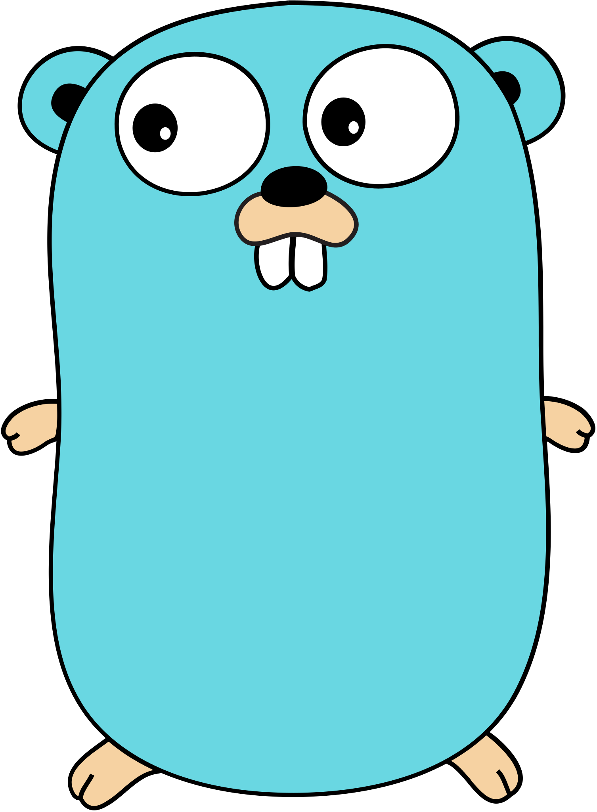

#  Go

> <i>Этот репозиторий несет одну логическую цель: учить основы Go. Просто потому что мне нравится этот язык. Синий цвет и Go Gopher.

> В исходном коде можно будет увидеть иногда мысли, цитаты, стихи и так далее.